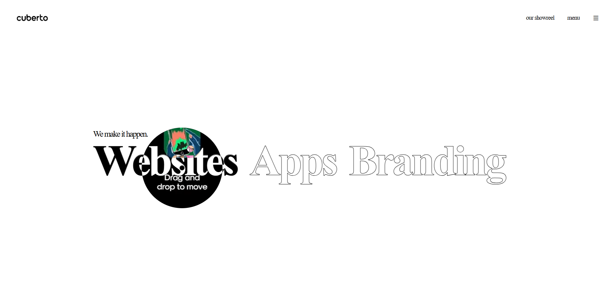
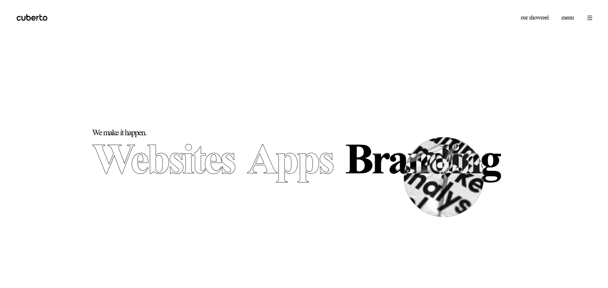
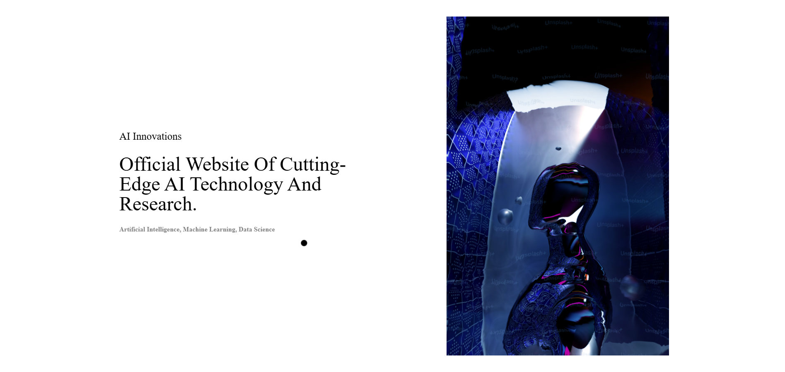
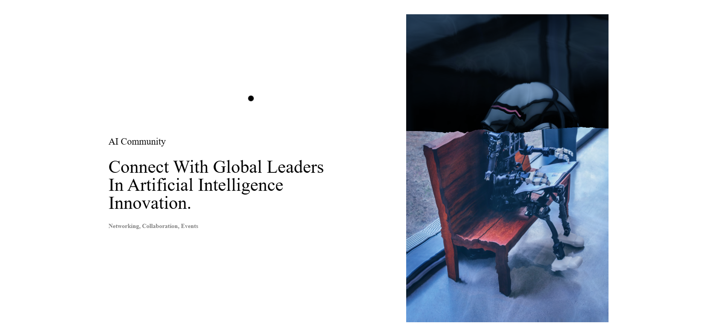
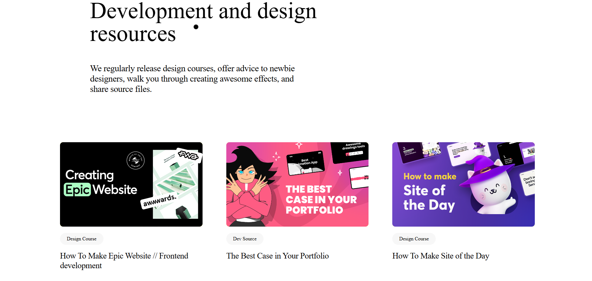
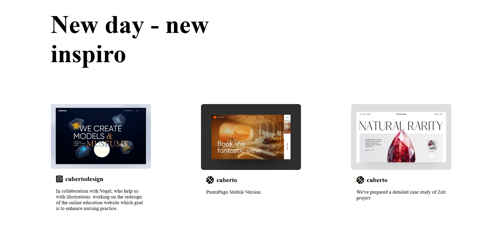

# Cuberto-Inspired Landing Page

This project is a visually stunning landing page inspired by the design principles of Cuberto, showcasing modern web development practices with interactive features and responsive layouts.

## Video Walkthrough

Watch a walkthrough of the project here:  

## Live Link

Explore the live version of the project here:  
**[Cuberto-Inspired Landing Page](https://cuberto-by-gideon.netlify.app/)**

## Features

- **Elegant Navigation**: A clean and responsive navigation bar with interactive menu options.
- **Hero Section**: Eye-catching hero section with bold typography and hover effects.
- **Featured Projects**: A curated list of projects with smooth animations and descriptive text.
- **Development Resources**: A section highlighting educational content for developers and designers.
- **Inspirational Cards**: An interactive card carousel featuring creative designs and collaborations.
- **Animations**: Utilizes GSAP for scroll-based animations and hover effects for an immersive user experience.

## Technologies Used

- **HTML5**: For the structure and content of the webpage.
- **CSS3**: Tailored styles for responsive layouts, animations, and hover effects.
- **JavaScript**: Added interactivity using GSAP and Shery.js libraries.
- **Shery.js**: Enabled hover media interactions and magnet effects.
- **GSAP**: Smooth scroll-triggered animations.

## Screenshots

| Section | Screenshot 1 | Screenshot 2 |
|---------|--------------|--------------|
| Home |  |  |
| Featured Projects |  |  |
| Inspiration Cards |  |  |

